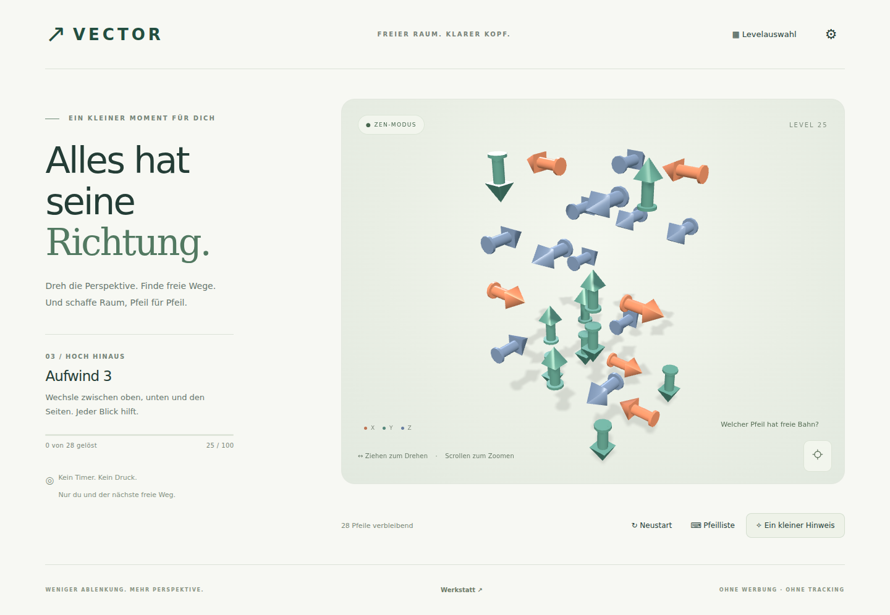

# VECTOR

Werbefreies, clientseitiges 3D-Puzzle in TypeScript, Three.js und Vite. Keine Konten, Analytics, externen Fonts oder In-App-Käufe.



[Prüfbericht](docs/VALIDATION.md) · [Automatische Tests](../../actions)

## Lokal starten

Node.js 22.12+ oder 24 LTS:

```sh
npm ci
npm run dev
```

Die von Vite angezeigte lokale URL öffnen. Produktionsversion: `npm run build`, danach `npm run preview`. Den Inhalt von `dist/` auf einem statischen HTTPS-Host bereitstellen. Relative Assetpfade unterstützen Unterordner wie `/arrow3d/`.

## Steuerung

- Maus / ein Finger ziehen: Kamera drehen. Klick / Tippen: Pfeil entfernen.
- Mausrad / Pinch: Zoom. Zentrierknopf: Ausgangsansicht.
- Pfeiltasten: Kamera drehen; + / −: Zoom; 0: Zentrieren.
- **Pfeilliste**: alternative Tastaturbedienung, einschließlich verdeckter Pfeile.
- Drei Hinweisstufen: allgemeiner Tipp, Ebene markieren, freien Pfeil markieren.
- Zen ohne Zeitdruck; Challenge mit Fehlern und Sternen. 3 Sterne ohne Fehler/Hinweise, 2 bei höchstens 3 Fehlern, sonst 1. Kein Game-over.

## Architektur

- `src/core/puzzle.ts`: reine Rasterregeln, Parser, unveränderliche Spielzüge.
- `src/core/solver.ts`: vollständiger Solver und transparente Schwierigkeitsheuristik.
- `src/game/scene.ts`: Three.js, OrbitControls, Raycasting, Animationen, gemeinsame Geometrien.
- `src/game/audio.ts`: optionale synthetische Klänge; keine Audio-Downloads.
- `src/levels/`: Laden und deterministische Reverse-Generation.
- `src/storage/save.ts`: versionierter, validierter lokaler Fortschritt mit Fehlerbehandlung.
- `src/editor/editor.ts`: integrierte 3D-Werkstatt, Bearbeitung, Import/Export, Solver, Generator.
- `public/levels/campaign.json`: externe Leveldefinitionen.
- `tests/`: Logik- und Browserprüfungen.

### Warum kein Backtracking?

Jeder Pfeil besetzt genau eine ganzzahlige Rasterzelle. Jede andere belegte Zelle auf demselben positiven Richtungsstrahl blockiert ihn – unabhängig von deren Richtung. Die Pfeilgeometrie liegt vollständig innerhalb der Zelle. Nur Entfernen ist erlaubt: Ein legaler Zug kann nie einen bisher freien Weg blockieren. Deshalb ist eine topologische Elimination vollständig, ohne exponentiellen Suchbaum. Ein Restzustand ohne freie Pfeile enthält einen Abhängigkeitszyklus oder hängt davon ab. Für ein lösbares Puzzle sind genau so viele Schritte nötig, wie es Pfeile gibt. Es gibt keine legalen Fehlentscheidungen, die später eine Sackgasse erzeugen. Schwierigkeit entsteht aus Erkennen, Verdeckung und Abhängigkeiten, nicht aus strategischen Fallen.

### Levelqualität

Die ersten fünf Levels sind handgebaut. Weitere Levels werden aus je zwölf deterministischen Reverse-Generation-Kandidaten ausgewählt und mit derselben Spiellogik vollständig gelöst. Die Heuristik berücksichtigt Größe, Startzüge, Abhängigkeitstiefe und achsenbezogene Verdeckung. Sie ist **keine wissenschaftliche Schwierigkeitsmessung**. `public/levels/curation.json` dokumentiert die Auswahl. Eine echte menschliche Spieltest-Kuration und Feinabstimmung der 100-Level-Kurve bleibt sinnvoll.

## Werkstatt

Unten auf **Werkstatt** klicken. Pfeile im Bild oder in der Liste wählen; X/Y/Z und Richtung ändern; Änderungen mit **Übernehmen** sichern. **Hinzufügen** nutzt die eingestellten Koordinaten und lehnt Doppelbelegungen ab. Eigene Levels als JSON exportieren; Werkstattänderungen bleiben bis zum Schließen im Speicher und verändern die Kampagne nicht. Der Generator besitzt einen reproduzierbaren Seed. Solverbefund und Lösung erscheinen unter **Lösbarkeit prüfen**. **Level spielen** öffnet eine Testsitzung, die keine Kampagnensterne freischaltet.

`?dev` zeigt FPS, Draw Calls, Level, Pfeilzahl, freie Züge und Solverbefund. Die interne Browser-Testbrücke existiert ausschließlich im Vite-Entwicklungsmodus.

## Prüfen

```sh
npm test
npm run build
npx playwright install chromium
npm run test:browser
npm run test:offline
npm run generate
```

`CHROMIUM_PATH` kann für eine bereits installierte Chromium-Binary gesetzt werden. Die Tests decken sechs Richtungen, Blockaden, unveränderliche Züge, Zyklen, Parser, Speichern und Lösungen der Kampagne ab. Browserprüfungen nutzen echte UI-Interaktionen und WebGL; Headless-Messungen mit Software-Rendering ersetzen keine Messungen auf echten Smartphones.

## Speicherung und Datenschutz

Fortschritt, Sterne und Einstellungen liegen ausschließlich in `localStorage` unter `vector-save-v1`. Löschen der Browserdaten entfernt den Spielstand. Ist der Speicher gesperrt, funktioniert das Spiel für die Sitzung weiter. Ein gestarteter Level wird beim Neuladen von vorn begonnen. Kein Tracking und keine personenbezogenen Eingaben.

## Offline / Installation

Der Produktions-Build erzeugt App-Icons, Manifest und einen versionierten Service Worker. Nach dem ersten vollständigen Laden unter HTTPS (oder localhost) startet VECTOR auch ohne Verbindung; die gesamte Kampagne wird zwischengespeichert. Die Installation erfolgt über die Browserfunktion „App installieren“ bzw. „Zum Home-Bildschirm“. Im Vite-Entwicklungsmodus bleibt der Service Worker deaktiviert. Ein Update wird nach dem Schließen der alten Spiel-Tabs aktiv.

GitHub Actions prüft Logik, Build, Browser und Offline-Verhalten und stellt `dist/` als herunterladbares Artefakt bereit. Es erfolgt keine automatische Veröffentlichung.

## Noch offen / sinnvolle nächste Schritte

- Menschliche Spieltests und Feinkuration der Levelkurve.
- Tests auf realen iOS-/Android-Geräten und deren Installationsdialogen.
- Editor-Undo/Redo, Spiegelung und Mehrfachauswahl (optionale Erweiterungen).
- Website-Hosting konfigurieren; ein GitHub-Repository allein ist noch keine veröffentlichte Spieladresse.

Eigenständige Gestaltung und eigene Level. Keine Assets, Marken oder Level anderer Spiele übernommen.
