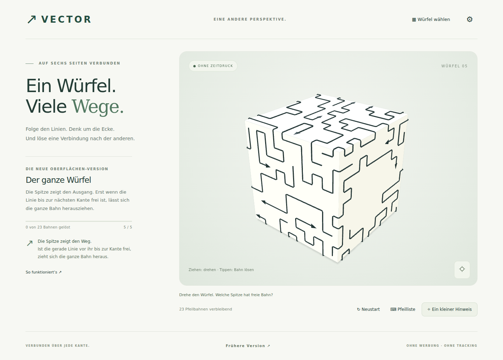

# VECTOR · Oberflächen-Puzzle

**Direkt spielen:** https://jasminetagwercher-alt.github.io/arrow3d/

Lange, geknickte Pfeilbahnen liegen auf den sechs Flächen eines geschlossenen Würfels. Sie schlängeln sich über Kanten und zwischen den anderen Bahnen hindurch. Ein freier Pfeil zieht sich als zusammenhängende Linie heraus.



## Stand dieser Version

Die neue Spielmechanik enthält **fünf sofort spielbare Würfel** mit 9, 10, 14, 15 und 23 langen Pfeilbahnen. Alle sind mathematisch lösbar und wurden im Browser vollständig über die Oberfläche gelöst. Dies ist der vereinbarte erste Prototyp für die korrigierte Spielidee; die neue 100-Level-Kampagne und weitere Körperformen folgen erst nach der Erprobung.

Die frühere Umsetzung mit frei schwebenden kurzen Pfeilen bleibt über **Frühere Version** bzw. `?classic=1` erreichbar. Ihre 100 Levels, Werkstatt und bisherigen Spielstände bleiben getrennt erhalten.

## Regeln und Bedienung

- Jede Bahn hat ein Ende und eine Pfeilspitze. Ihr Verlauf kann über mehrere Würfelseiten führen.
- Die **gerade Linie vor der Spitze bis zur nächsten Körperkante** muss frei von anderen Pfeilbahnen sein. Jeder Abschnitt einer anderen Bahn kann blockieren, nicht nur deren Spitze.
- Beim Lösen bewegt sich die Spitze tangential geradeaus in den freien Raum. Das Ende wird entlang des bisherigen Verlaufs nachgezogen. Die Austrittsrichtung folgt nicht erneut um die nächste Würfelkante.
- Ziehen dreht, Mausrad oder Pinch zoomt. Tippen auf einen beliebigen sichtbaren Abschnitt wählt die ganze Bahn. Beim Darüberfahren wird sie blau hervorgehoben.
- Der Körper verdeckt tatsächlich die rückwärtigen Bahnen. Durch ihn hindurch kann nicht geklickt werden.
- Pfeiltasten drehen; + / − zoomen; 0 zentriert. Die **Pfeilliste** bietet alternative Tastaturbedienung.
- Drei Hinweisstufen: allgemeiner Tipp, passende Seite zeigen, konkrete freie Bahn markieren.
- Keine Leben, Werbung, Anmeldung oder Zeitlimits. Optionale synthetische Klänge; reduzierte Bewegung folgt der Systemeinstellung.

## Lokal starten

Node.js 22.12+ oder 24 LTS:

```sh
npm ci
npm run dev
```

Produktionsversion: `npm run build`, anschließend `npm run preview`. Der Ordner `dist/` ist die fertige statische Website. Relative Assetpfade unterstützen `/arrow3d/`.

## Architektur der neuen Mechanik

- `src/entry.ts`: Standardspiel und separat erreichbare frühere Fassung.
- `src/surface/core.ts`: rendererunabhängiges Flächenraster, Kantenübergänge, Parser, Blockaden und vollständiger Solver.
- `src/surface/generator.ts`: deterministische Reverse-Generation langer, mehrfach geknickter Bahnen.
- `src/surface/view.ts`: geschlossener Körper, Bahnen, verdeckungsrichtige Auswahl und Nachzieh-Animation.
- `src/surface/app.ts`: Bedienung, fünf Würfel, Hinweise und separater lokaler Fortschritt.
- `public/levels/surface.json`: externe Leveldaten mit vollständigen Pfaden von Ende zu Spitze.
- `scripts/surface-levels.ts`: reproduzierbare Erstellung der fünf Würfel.

Jede Fläche besitzt ganzzahlige Rasterkoordinaten. Kantenübergänge transportieren Position und Bewegungsrichtung in das Koordinatensystem der Nachbarfläche. Belegte Felder dürfen sich nicht überschneiden, Pfade müssen lückenlos sein, und eine Bahn darf ihre eigene Austrittslinie nicht belegen. Entfernen bleibt monoton: Ein erlaubter Zug kann keine neue Blockade erzeugen. Deshalb ist der Solver ohne exponentielles Backtracking vollständig.

Die Darstellung hebt Linien minimal von der Oberfläche ab, damit sie sauber sichtbar bleiben. Beim Überqueren einer Kante wird ein zusätzlicher Eckpunkt eingesetzt; dadurch schneiden die Bahnen nicht durch den Körper. Die Auszieh-Animation ist anhand der Weglänge parametrisiert.

## Prüfen und neue Würfel erzeugen

```sh
npm test
npm run build
npx playwright install chromium
npm run test:browser
npm run test:offline
node --import tsx scripts/surface-levels.ts
```

`CHROMIUM_PATH` kann auf einen bereits installierten Chromium-Browser zeigen. Die Tests enthalten weiterhin die Regressionstests der früheren Version. Die zusätzlichen Oberflächentests prüfen Kantenübergänge, fremde Bahnabschnitte als Blockaden, vollständige Lösungen, verdeckte Pfeile, Drag-/Touch-Gesten und die Bewegung beim Herausziehen. Desktop-/Mobilbilder wurden visuell geprüft. Echte iOS-/Android-Geräte und die endgültige Levelkurve sind noch nicht abschließend getestet.

[Prüfbericht zur neuen Mechanik](docs/SURFACE-VALIDATION.md)

## Speicherung und Offline-Betrieb

Die neue Fassung speichert unter `vector-surface-v2`, die frühere unter `vector-save-v1`. Das Zurücksetzen einer Fassung verändert die andere nicht. Der aktuelle Würfel beginnt beim erneuten Laden von vorn; abgeschlossene Würfel und Audioeinstellung bleiben erhalten.

Der Produktions-Build erzeugt Manifest, Icons und einen Service Worker. Nach dem ersten vollständigen Laden sind beide Fassungen offline verfügbar. Neue Worker werden nach erfolgreichem vollständigem Caching aktiviert. Die vorherige Cachegeneration bleibt für noch offene ältere Tabs erhalten. Bei einer neuen Veröffentlichung die Seite neu laden.

## GitHub Pages

Unter **Settings → Pages → Build and deployment → Source** muss **GitHub Actions** ausgewählt sein. Der Workflow **Publish VECTOR to GitHub Pages** baut das Spiel und veröffentlicht `dist/`. Bei einer noch aktiven direkten Veröffentlichung aus `main` startet der neue Workflow nach dem eingebauten Pages-Lauf nochmals und stellt die gebaute App wieder her. Die Umstellung auf **GitHub Actions** vermeidet diesen unnötigen Doppellauf.

## Nächste Entwicklungsschritte

- Spielgefühl und gewünschte Bewegungsregeln anhand dieser fünf Würfel erproben.
- Weitere Körperformen (Quader, abgewinkelte Körper) ergänzen.
- Neue Oberflächen-Kampagne kuratieren und den Editor auf Flächenbahnen erweitern.
- Reale Touch-Geräte, Sichtbarkeit dichter Muster und längere Spielsitzungen testen.

Eigenständiger Code, eigene Gestaltung und eigene Level; keine übernommenen Spiel-Assets.
